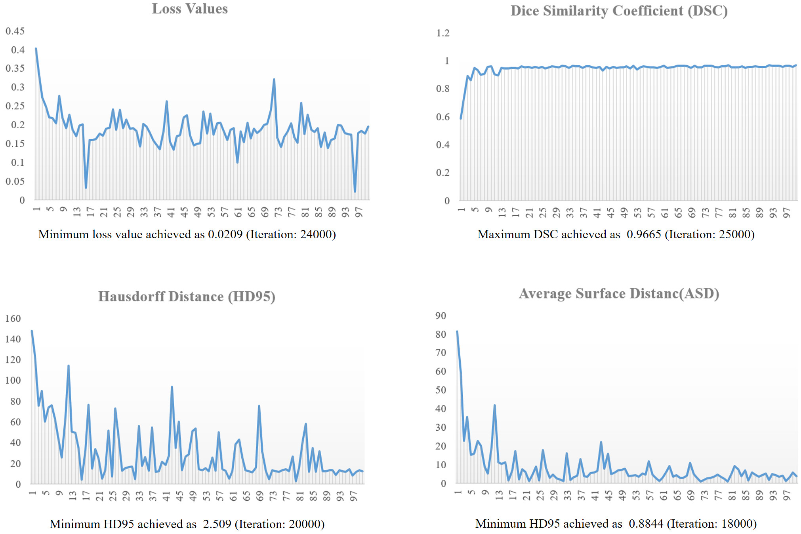
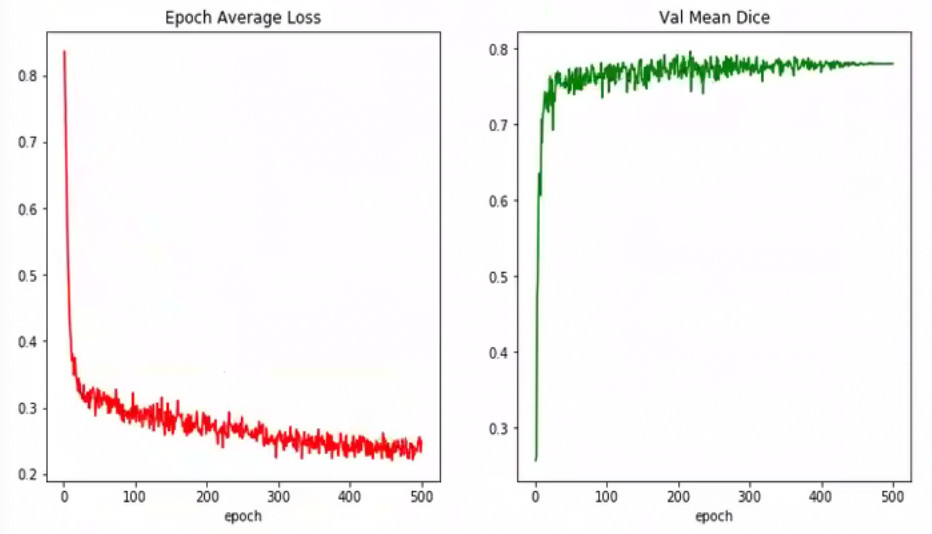
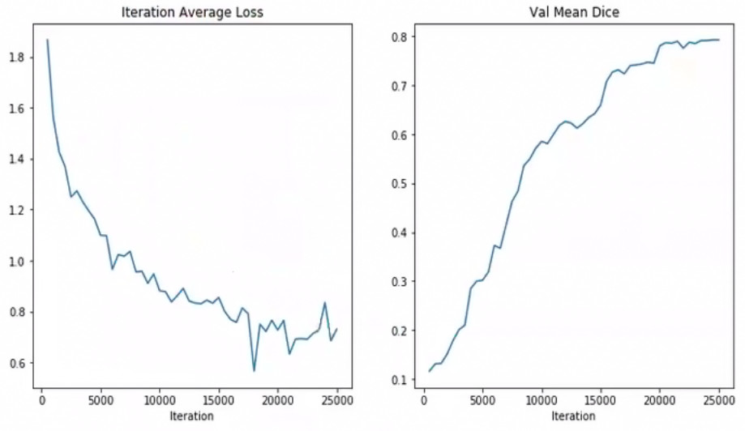

# Implementation of UNETR: Transformers for 3D Medical Image Segmentation

This repository is an implementation of [UNETR: Transformers for 3D Medical Image
Segmentation](https://arxiv.org/pdf/2103.10504v1.pdf) using PyTorch and MONAI. 

## Requirements

To install requirements:

```setup
python 3.7+ needed

pip3 install torch torchvision
pip3 install monai
```

## Training and Evaluation

To train and evaluate the model(s) in the paper, run command in this format:

```train
python {file}.py
```

Example:
```train
python btcv.py
```

## Pre-trained Models

You can download pretrained models here:

- [UNETR](https://drive.google.com/file/d/1dKuJCcOTNAppF-GgEM0Sgiq9Qn8VmeZz) trained on Medical Segmentation Decathlon Spleen Task. 

The following hyperparameters were used during the model’s implementation process:

| Parameter | Description  | Value |
| ------------------ |---------------- | -------------- |
| Hidden Layer Size  |     Dimension of hidden layer          |      768       |
| Feature Size       |     Transformer’s embedding size          |      16        |
| Dropout Rate  |     Transformer dropout rate        |      0.1        |
| Attention heads  |     Number of attention heads for transformer         |      12        |
| Weight Decay | Adam weight decay to prevent overfitting | 0.00000001       |
| Iterations | Number of times the algorithm's parameters are updated | 25000       |
| Learning Rate | The learning rate | 0.0001      |
| Transformer MLP Size | Dimension of feed-forward layer | 3072      |
| Patch | Size for Patches | 16*16*16     |

## Results

The model achieves the following performance on [Medical Segmentation Decathlon](http://medicaldecathlon.com/) Spleen Task:

| Metric       | Result  | Iteration
| ------------------ |---------| ------- |
| Loss Values   |     0.0209 | 24000       |
| Dice Similarity Coefficient (DSC)  |     0.9665 | 25000       |
| Hausdorff Distance (HD95)   |     2.509 | 20000    |
| Average Surface Distance   |     0.8844 | 18000   |

Here are how the metrics look like versus an average of every 250 iterations:



The model achieved the best dice metric of 0.7955 and loss of 0.2636 at epoch 217 and it took a total time of 93438.3144 seconds on the [Medical Segmentation Decathlon](http://medicaldecathlon.com/) Brain Tumour Task. Here are how the metrics look like:


The results on the Beyond the Cranial Vault Abdomen data set are as shown below. The model achieved the best dice metric of 0.7928 at epoch 24500 and minimum loss value of 0.56656 at epoch 18000.


The results on the [Medical Segmentation Decathlon](http://medicaldecathlon.com/) Liver Tumour Task data set are as shown below. The model achieved the best dice metric of 0.76 at epoch 71000.


## Contributing
Feedback and/or contributions welcome! Send us a pull request or contact us at dlgroup28@gmail.com.
